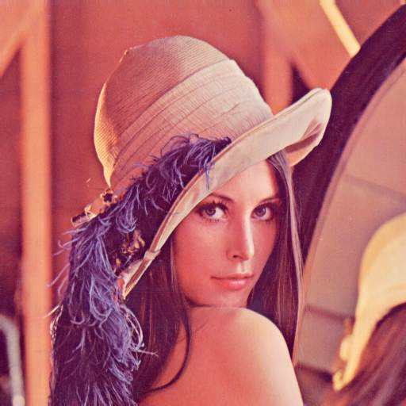
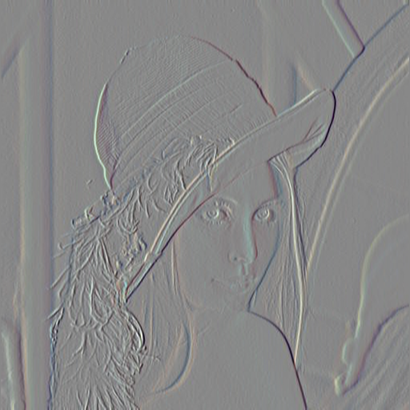
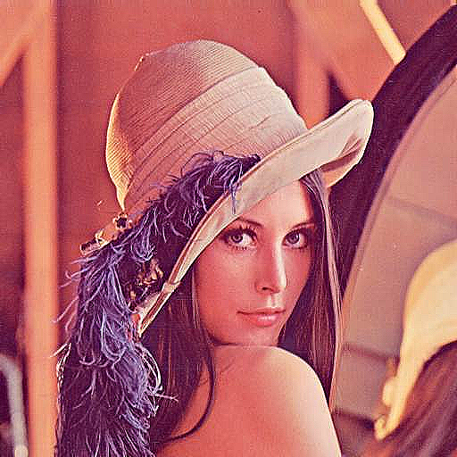
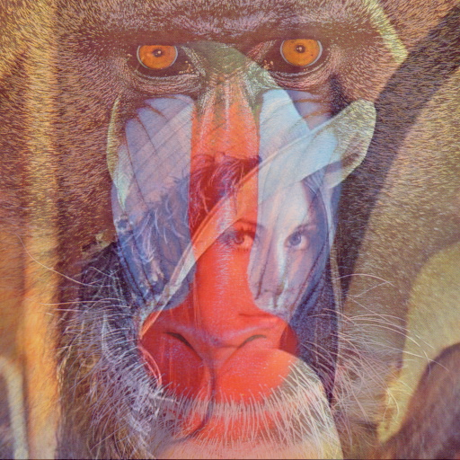

# OpenCV-Examples

Some OpenCV examples.

## Environment

OS: Ubuntu 16.04

OpenCV version: 3.4.1

## Examples

### 01-Hello world

Reading an image and keeping the data with **cv::Mat** object.

### 02-Image operation

Accessing a point in the matrix using **cv::Mat::at**.
Computing the value of the gradient with **sobel operator** along different axes.

### 03-Mask

Calculating the convolutional result of each pixels value in an image according to a mask matrix.

### 04-Blending

Calculating the weighted sum of two images.

    
    
    

### 05-Contrast

Changing the contrast and brightness of an image.

    
    
    

