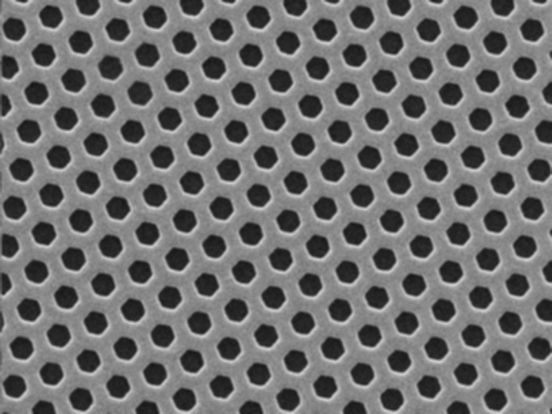
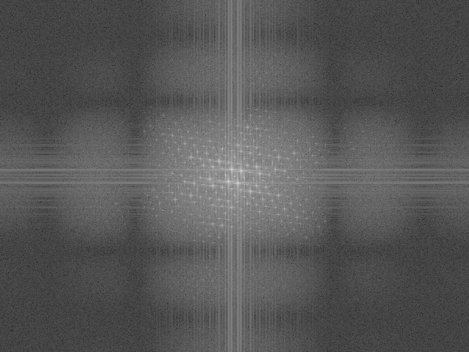
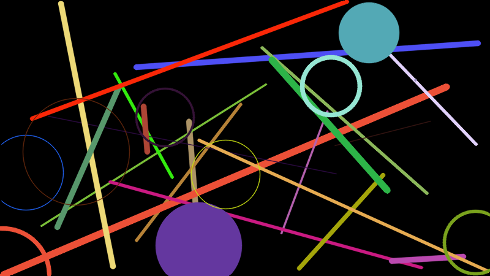
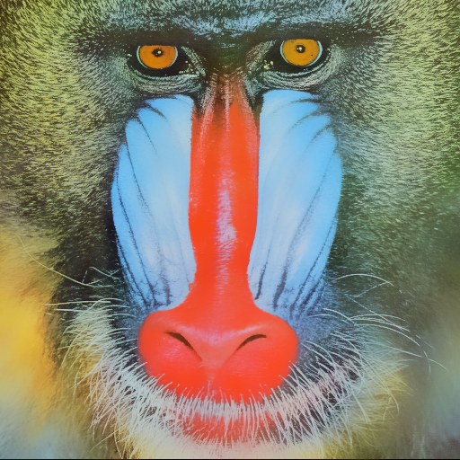

# OpenCV-Examples

Some OpenCV examples.

## Environment

OS: Ubuntu 16.04

OpenCV version: 3.4.1

## Examples

### 01-Hello world

Reading an image and keeping the data with **cv::Mat** object.

### 02-Image operation

Accessing a point in the matrix using **cv::Mat::at**.
Computing the value of the gradient with **sobel operator** along different axes.

### 03-Mask

Calculating the convolutional result of each pixels value in an image according to a mask matrix.

### 04-Blending

Calculating the weighted sum of two images.

    
    
    

### 05-Contrast

Changing the contrast and brightness of an image.

    
    
    

### 06-Fourier transform

Applying the **low pass filter** to the image and observe the result.

    
    

### 07-File IO

Using cv::FileStorage, cv::FileNode and cv::FileNodeIterator to write/read the text entries to a file. The output file may be either **XML (xml) , YAML (yml/yaml) or xml.gz** which is depend on the file extension.

### 08-RNG

Using the **Random Number generator** class (cv::RNG) to create random textures and overlay the textures on the canvas.

    
    

### 09-Smmothing image

Applying diverse **linear filters** to the image using OpenCV functions (blur, GaussianBlur, medianBlur and bilateralFilter).

    
    

    
    

## Reference

1. <https://docs.opencv.org/3.4/d9/df8/tutorial_root.html>